## IoT제어 프로젝트

* 시뮬레이터 및 프로젝트 관련 파일 다운로드
  - https://drive.google.com/drive/folders/1rp54qL31ZIoHet7A9BlvpoDCCdGVsvLK?usp=sharing

(위 경로에 위치한 프로그램 및 문서는 SSAFY 과정 내에서만 사용할 수 있으며 무단 복제 및 반출, 배포를 금합니다.)

## **명세서 기능 진척률**

100%

## **좋았던 점, 알게된 점**

터틀 봇에 달려있는 카메라를 다뤄 볼 수 있어서 좋았고, 앞으로 perception node에서 영상 인식에 관련된 기능들을 구현해야한다는 것을 알게됐습니다.

물건을 옮기는 기능(handcontol)을 통해서 재미있는 기능을 추가할 수 있을 것 같아서 좋았습니다.

주기적으로 실행할 timer_callback 함수를 thread로 실행해서 비동기로 실행하는 방법에 대해 알게됐습니다. 나중에 프로젝트에서 필요할 때 해당 부분을 참고할 수 있습니다.
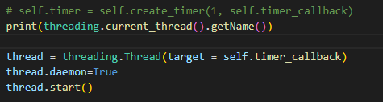

#### **오일러 각, 쿼터니언 각**

오일러는 알고리즘 계산시에 사용되고, 쿼터니언은 메시지에서 사용되는 것을 알게됐습니다.

|          | 장점                                                         | 단점                                                         |
| -------- | ------------------------------------------------------------ | ------------------------------------------------------------ |
| 오일러   | 직관적이라서 사용자가 원하는 대로 값을 적용하고, 알고리즘 계산에 사용할 때 수월. | 짐벌락 문제가 나타난다. 연산 속도가 느리다.             |
| 쿼터니언 | 짐벌락 문제가 나타나지 않는다. 연산 속도가 빠르다.      | 직관적이지 않아서 사용자가 계산이 필요할  때 사용하기 어렵다. |

#### **어려웠던 점**

1. create_publisher, create_subscriber 입력인자로  call_back 함수가 동작하고 msg로 값이 들어가는 원리를 이해하는 것이 어려웠습니다. 현재는 관련 api를 이해하였습니다.

2. 제공된 스켈레톤 코드에는 Global path 경로점의 리스트에서 현재 로봇과 가장 가까운 점을 찾는 알고리즘이라서 경로가 겹치는 경우에 Local path가 다른 경로위의 점으로 변경되는 경우가 생겼습니다.
   인덱스 범위 내에서 만 Local path가 선택될 수 있도록 하는 부분이 어려웠습니다. 팀원들과 소통하여 해결하였습니다.

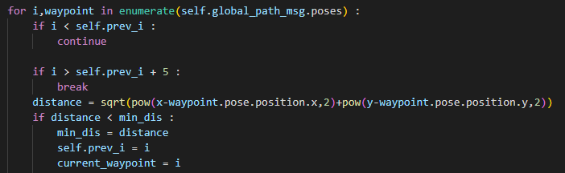

## 결과물

**Req 1 ROS 메시지 통신 노드 실행**

| publisher 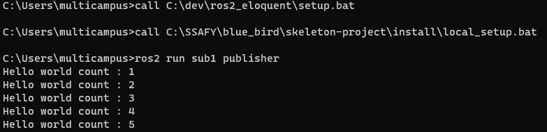 |
| ------------------------------------------------------------ |
| **subscriber** 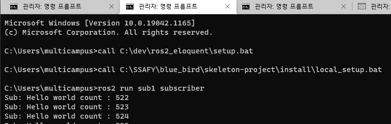                                            **** |
| **rqt result** 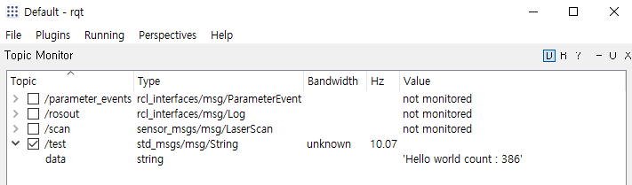           |
| **auto mode에서 자동으로 터틀 봇 제어** 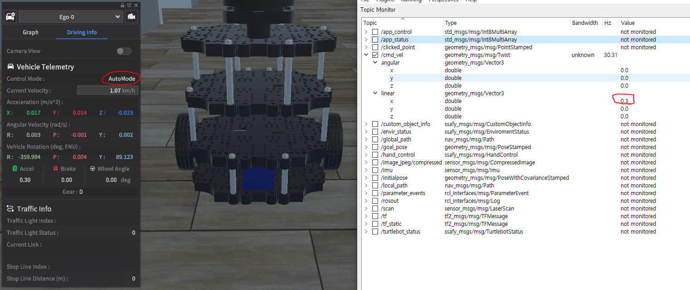 |

**Req 2 IoT(로봇, 가전, 환경)의 상태, 제어 메시지 송수신**

| **시뮬레이션화면** 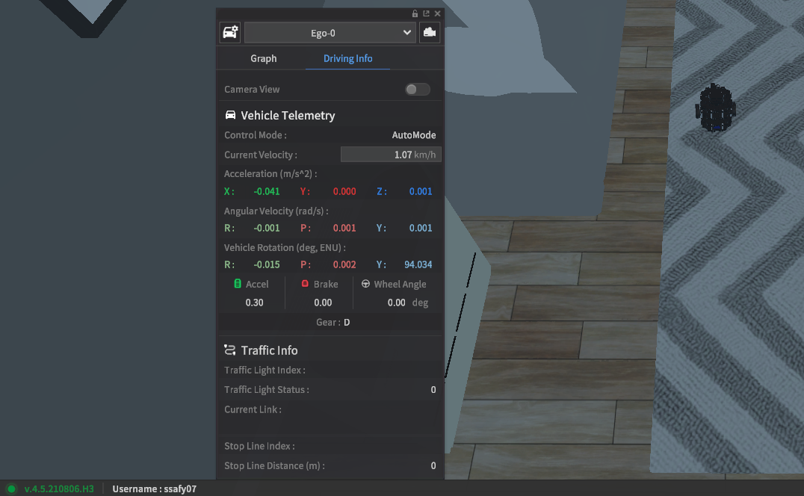 |
| ------------------------------------------------------------ |
| **앞으로 전진** 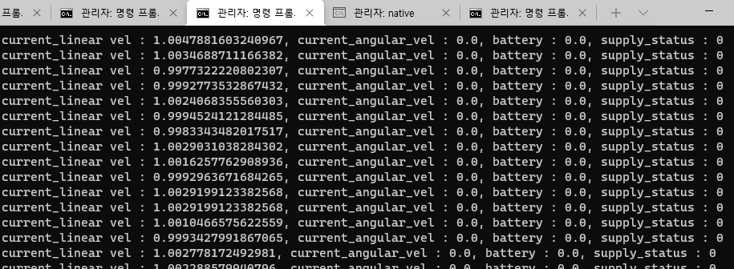  |
| **회전** 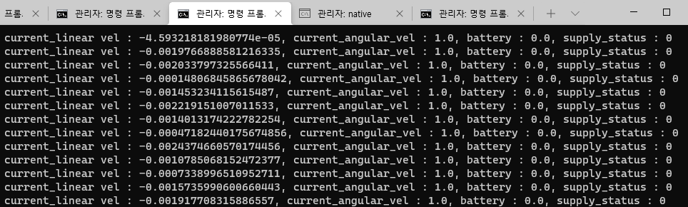 |
| **Moving in the auto mode** 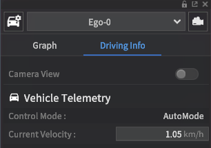 |
| **가전 기기 제어 - all on ** 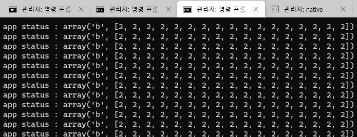 |
| 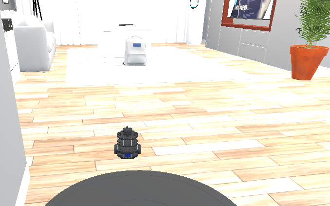                       |
| **가전 기기 제어 - all off** 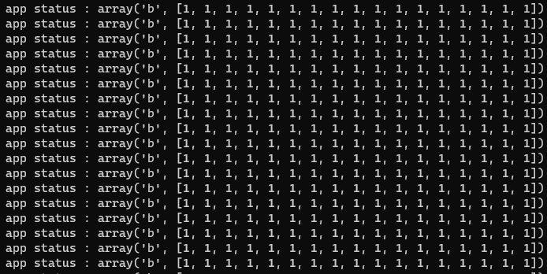 |
| 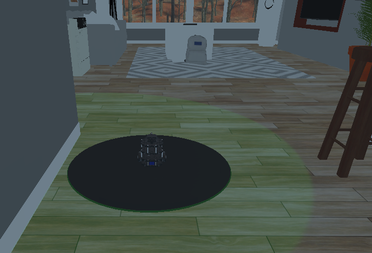                     |
| **환경 메시지 수신** 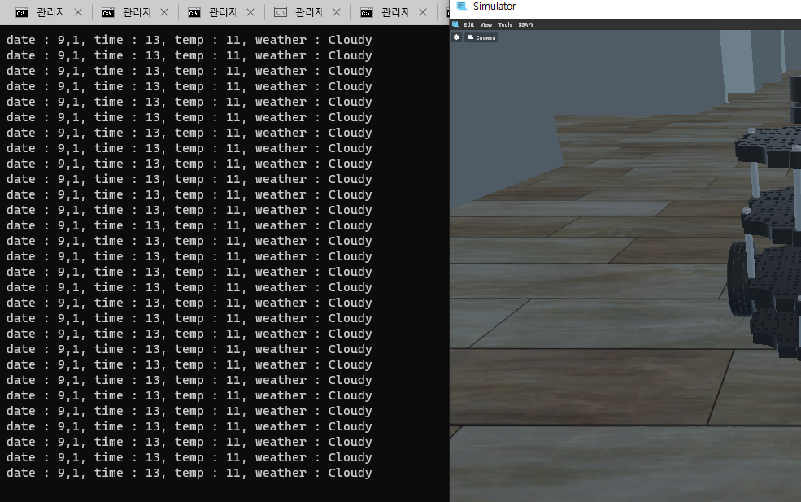 |

**Req 3 카메라 데이터 수신 및 영상처리**

gray scaling
size scaling: h = 1/2 * h, w =  1/2 * w

| **이미지 변환 후 화면** 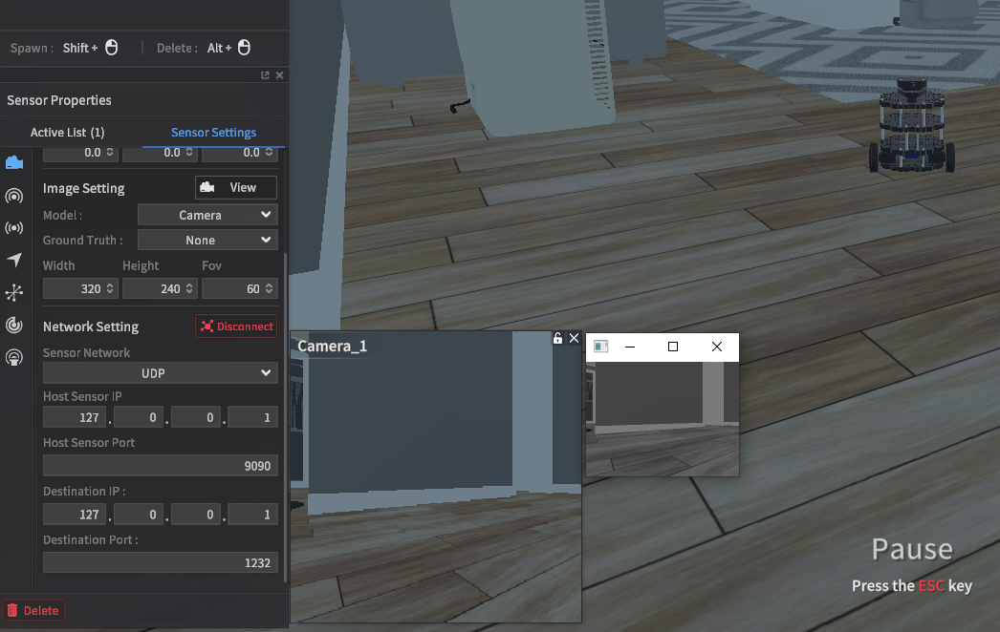 |
| ------------------------------------------------------- |

**Req 4 Hand Control 제어 메시지 송신**

| 들어 올릴 객체 생성 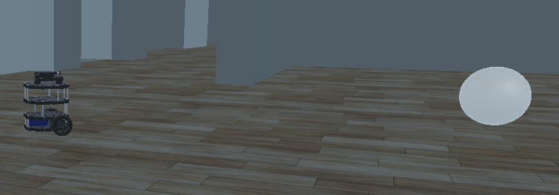 |
| ------------------------------------------------------------ |
| **0번 입력 시** 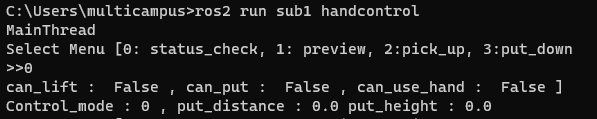          |
| **물체에 다가가서 들 수 있는 상태로 0 입력시** 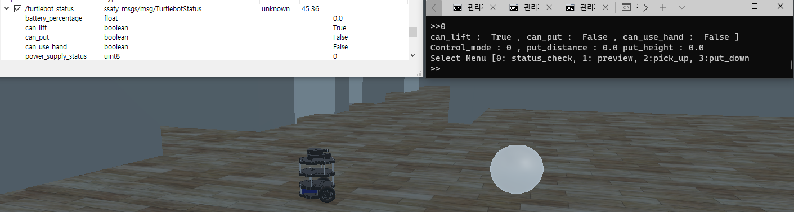 |
| **2번 입력으로 물건 들기** 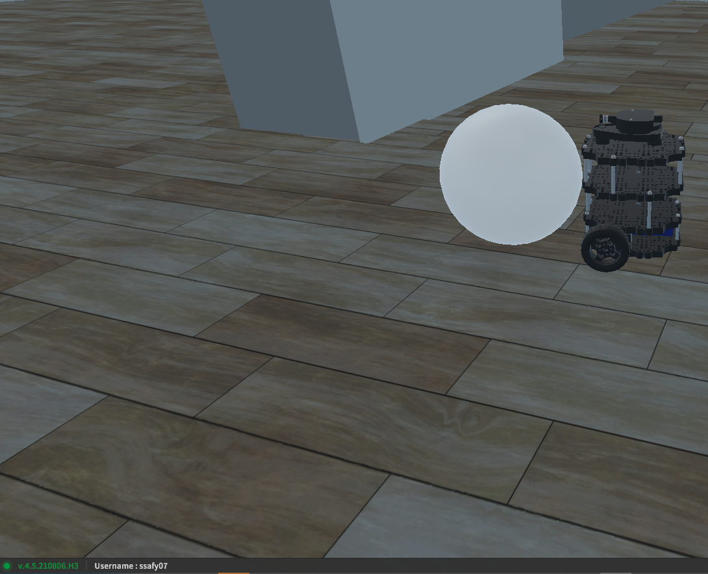 |
| **1번 입력으로 내려 놓을 수 있는지 확인 - 못내려 놓는 경우**  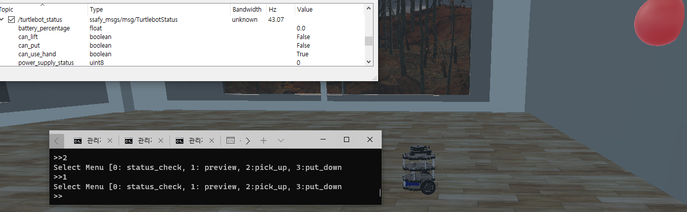 |
| **1번 입력으로 내려 놓을 수 있는지 확인 - 내려 놓을 수 있는 경우**  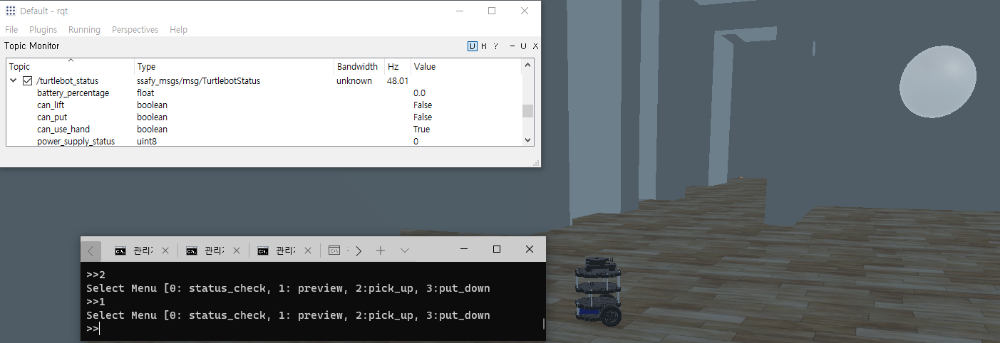 |
| **3번 입력으로 내려 놓기 ** 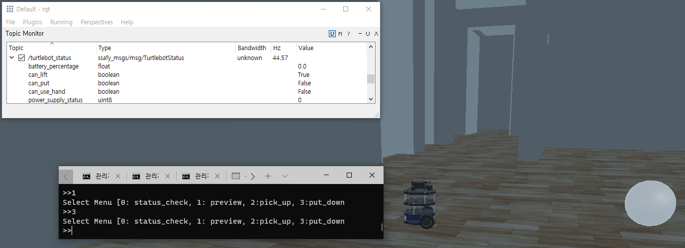 |

**Req 5-1 주행 기록계(Odometry를 이용한 위치 추정 및 기록)**

| **로봇 위치 추정 테스트** 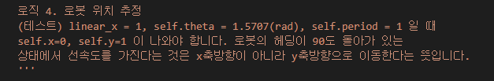 |
| ------------------------------------------------------------ |
| **테스트 결과** 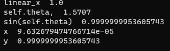          |
| **한 바퀴 돌아서 제자리 온 경우 rviz2 화면**  |

**Req 5-2 상대경로 생성**

| **상대 경로 생성 - 텍스트파일로 경로 기록** 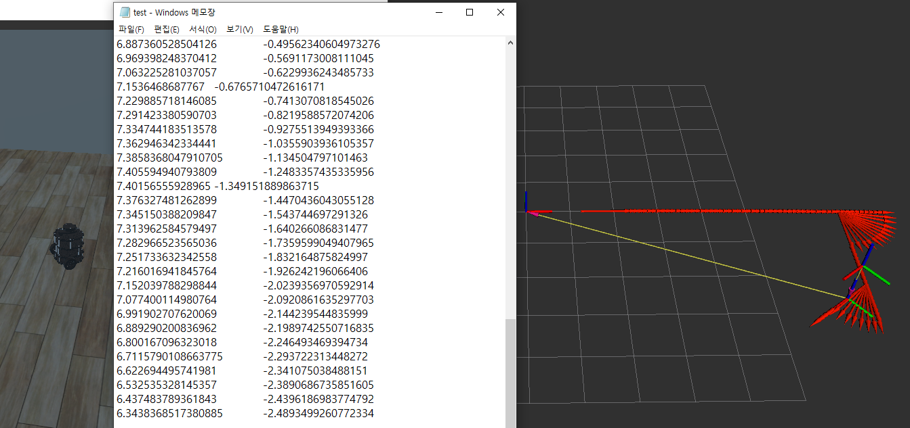 **상대 경로 생성 - rviz에서 global path로 확인** 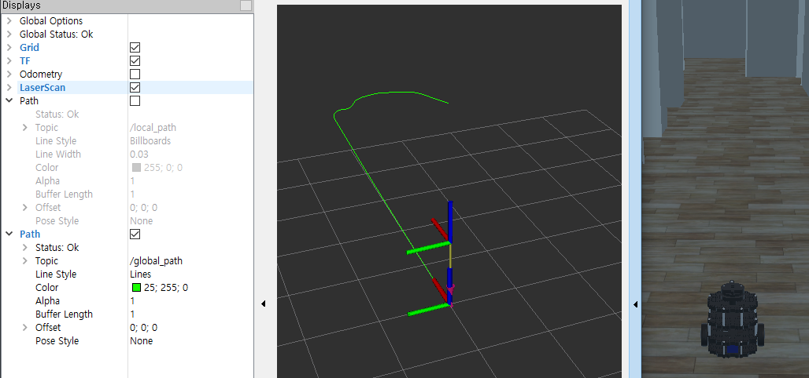 |
| ------------------------------------------------------------ |
| **Test - 이전 위치와 현재위치의 거리 계산** 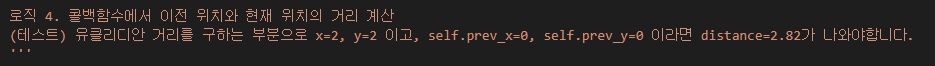 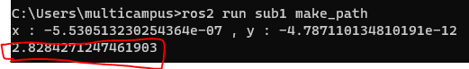 |

**Req 5-3 경로 읽어오기 및 경로 추종** 

| **Local path가 잘 적용되는지 확인** 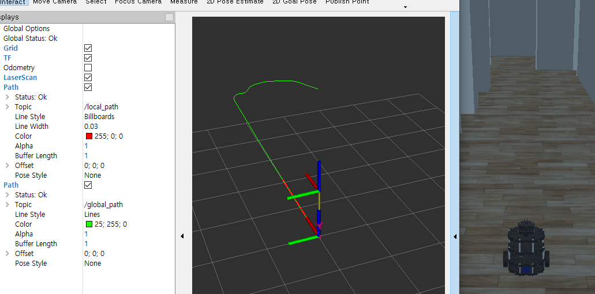 **이동 시 local path가 잘 적용되는 것 확인** 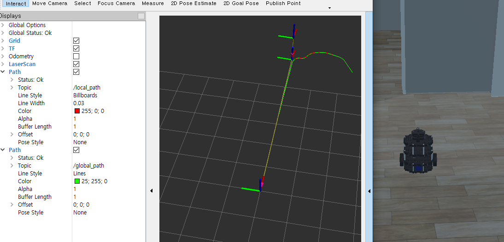 |
| ------------------------------------------------------------ |
| **Auto mode에서 자동으로 이동 확인**  auto mode에서 속도가 나고 global path에서 저장해 놓았던 경로로 이동하는 것 확인  **도착 확인**  |

