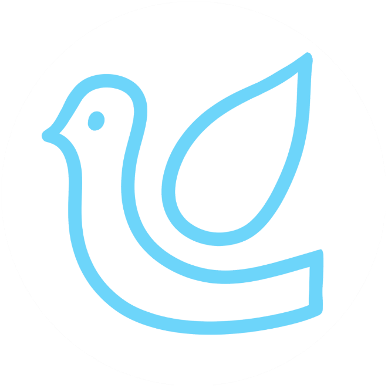
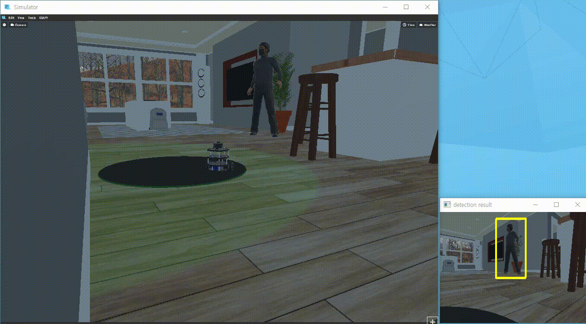
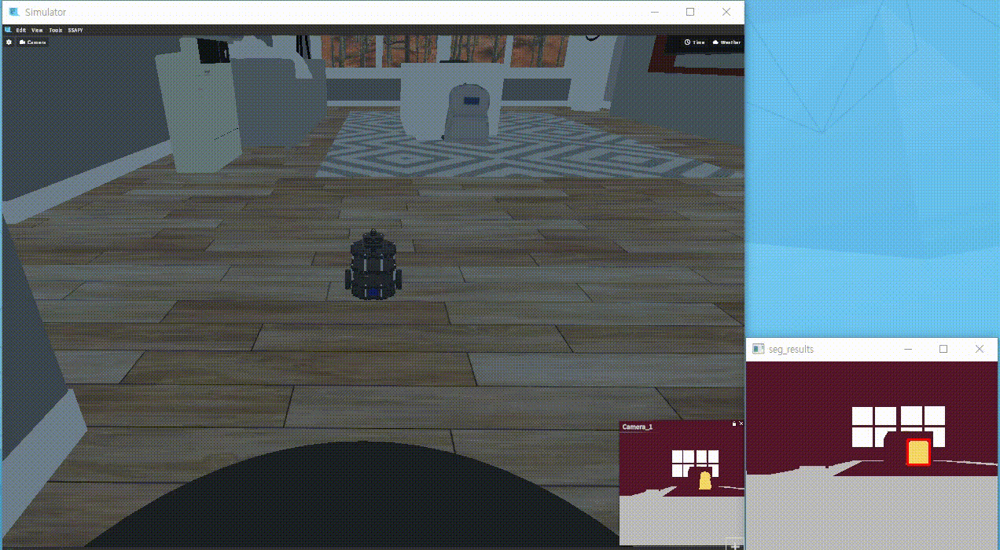
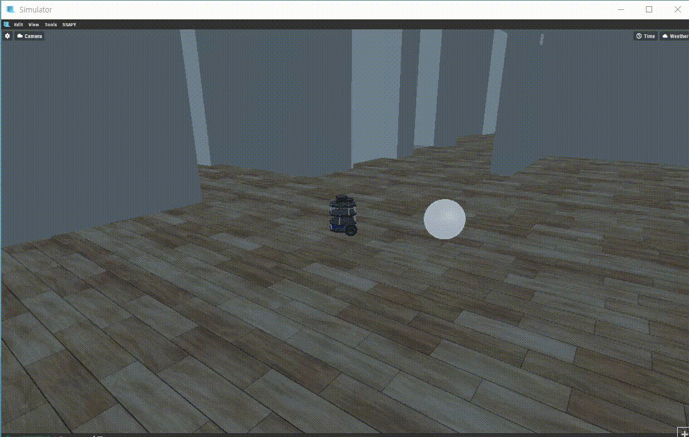
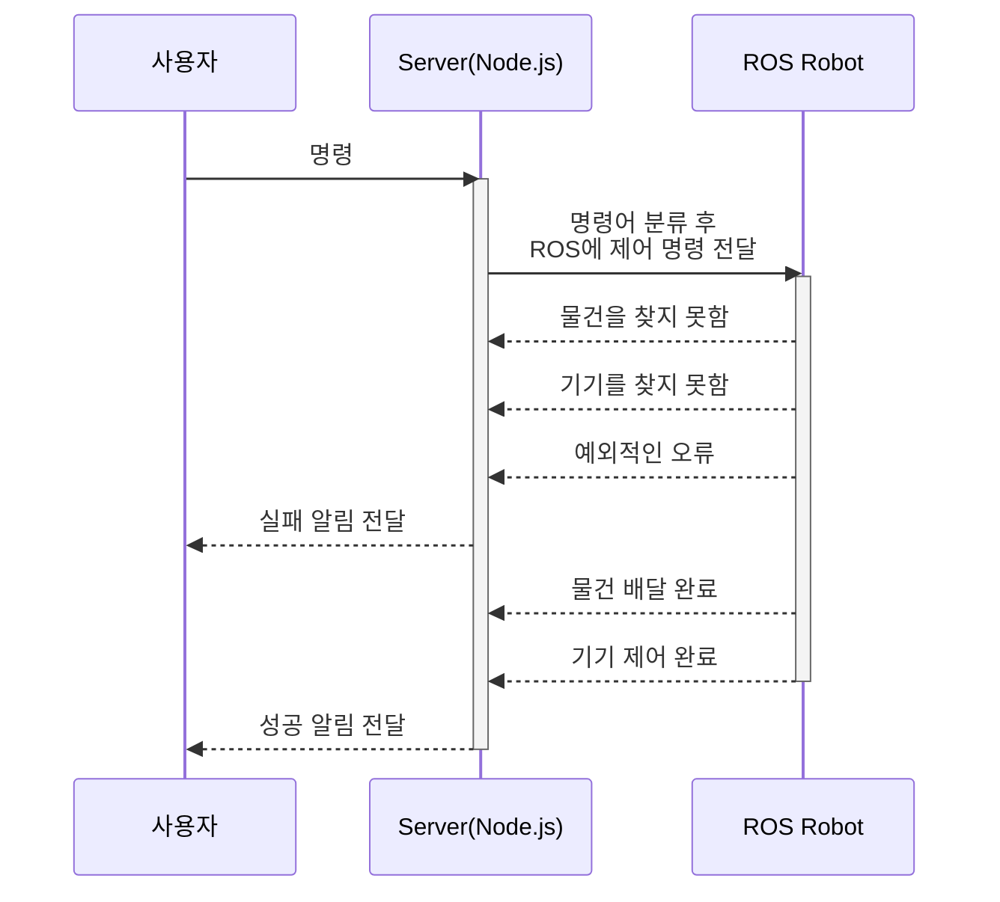

 

# 파랑새

### 직장에서의 잡무를 도와주는 헬퍼 로봇

## 목차

1. [개요](#개요)

2. [기술스택](#기술스택)

3. [로봇기능](#로봇기능)

   `최단 경로 탐색` / `장애물 회피` / `자율 주행` /  `공간 입체 인식` 

   `사람 인식` / `물건 인식` / `홈 IoT 기기 제어` / `물건 들고 내리기`

4. [프로젝트 구조](#프로젝트-구조)

5. [와이어프레임](#와이어프레임)

6. [DB](#DB)

7. [사용자 인터페이스 구성](#사용자-인터페이스-구성)

8. [참고](#참고)

8. [시연 영상](#시연-영상)

## 개요

> ### Member
>
> | Name   |
> | ------ |
> | 김예림 |
> | 박민상 |
> | 신기하 |
> | 이용직 |
>
> 
>
> ### 기획 - [Link](https://cultured-legume-5d9.notion.site/fe18afcec3e449e29c6ffcb475ba64b8)
>
> - IoT 기기를 통해서 전반적인 생활 패턴 편리화
> - 홈 IoT를 넘어서 더 큰 공간에서 활용되는 IoT
>
> 

## 기술스택

## 로봇기능

| 기능 | Action |
| :----: | :------: |
| 최단 경로 탐색 |  |
|  | <b>A* 알고리즘</b>을 통해 Grid Map 내에서 최단경로를 파악 실내 로봇은 GPS를 사용하지 않기 때문에 로봇의 모터의 속도, 관성센서를 가지고 움직인 거리를 계산하여 위치 파악 |
| 장애물 회피 |  |
|  | 벽이나 각종 장애물과 오차 범위 만큼 거리를 두고 로봇을 이동  => 로봇이 방향 전환을 할 때 부딪히지 않도록! Unity를 통해 장애물 생성 후 학습 및 알고리즘 수정 |
| 자율 주행 |  |
|  | 출발지에서 목적지까지 최단 경로(전역 경로->연두색 선)를 탐색 후 경로 입력 후 이동(지역 경로->빨간색 선) |
| 공간 입체 인식 |  |
|  | <b>라이다센서와 카메라 센서를 이용한 거리 측정</b> 라이다 포인트들이 카메라 내에서 어느 위치에 해당하는지 매칭하고, 카메라 내의 픽셀 위치에 겹치는 라이다 값들로 입체 공간 인식 (좌표변환) *라이다 포인트들 <=> 카메라 좌표계* |
| 사람 인식 |  |
|  | <b>OpenCV</b>를 이용해 사람 인식  (OpenCV내에 구현되어 있는 Descriptor인 hitogram of gradient와 support vector machine 이용) |
| 물건 인식 |  |
|  | BGR 이미지의 <b>Binarization</b>을 통해 물체의 Bounding Box 좌표를 찾기 (Semantic Segmentation) |
| 홈 기기 제어 |  |
|  | <b>UDP 통신</b>을 통해 로봇이 홈 IoT 기기 주변 일정 범위 안에 들어온다면 on/off 제어가 가능하도록 구현 |
| 물건 들고 내리기 |  |
|  | <b>메시지(Message)를 통해 제어</b> 로봇의 정해진 범위 내로 사물이 인식된다면 사물의 정확한 위치를 파악한 후 들기 / 로봇과 충돌을 방지하기 위하여 로봇에서부터 정해둔 거리만큼 먼 곳에 물건 내리기 |

[목차로 올라가기](#목차)

## 프로젝트 구조

[목차로 올라가기](#목차)

## 와이어프레임

### [Figma Link](https://www.figma.com/file/Csc8ybWnG6QRHI02c7iKJj/%ED%8C%8C%EB%9E%91%EC%83%88-%EC%99%80%EC%9D%B4%EC%96%B4%ED%94%84%EB%A0%88%EC%9E%84?node-id=0%3A1)

[목차로 올라가기](#목차)

## DB

[목차로 올라가기](#목차)

## 사용자 인터페이스 구성

| 기능 | View | Description |
| :----------------: | :------------------------------------------------------------: | ------------------------------------------------------------ |
| 로그인           |               | 회사 내의 IoT로 아이디(사원번호), 비밀번호는 전부 미리 주어진다고 가정 |
| 메인 화면 (Home) |  | 로봇이 다닐 수 공간, 즉 minimap 제공, 날짜, 날씨, 로봇의 현재 상태 (working or relaxing) 정보 제공 |
| 배달 명령 화면   |  | 장소, 물건, 도착지점을 선택하여 기기에 명령                  |
| 음성 명령 화면   |   | 중앙 버튼 클릭 후 음성으로 명령하면 기기 제어 가능           |
| 기기 제어 화면   |  | 장소 선택 후 해당 장소의 기기들을 on/off 버튼을 통해 제어 가능 |
| 마이페이지       |                                                              | 회원의 간단한 정보 확인                                      |
| 알림페이지       |  | 물건 배달 후 성공,실패 와 같은 알림 축적 ()                  |

[목차로 올라가기](#목차)

## 시연 영상

<video width="100%" height="100%" controls="controls">
  <source src="./assets/파랑새_시연_영상.mp4" type="video/mp4">
</video>

[목차로 올라가기](#목차)

## 참고

[파랑새들의 창고 Notion](https://cultured-legume-5d9.notion.site/20b03989c96e49efa1169cccee9a50bc)

